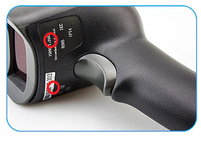
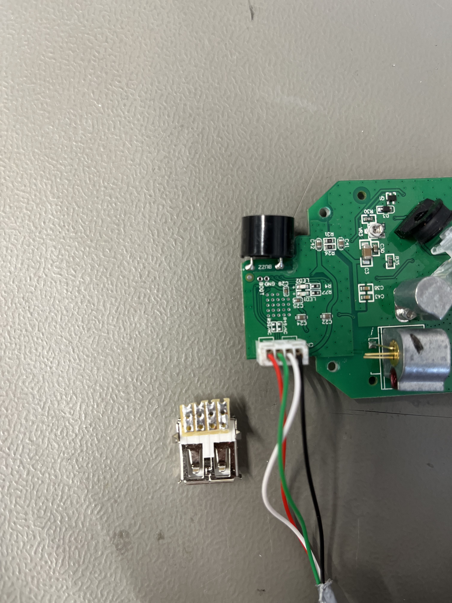
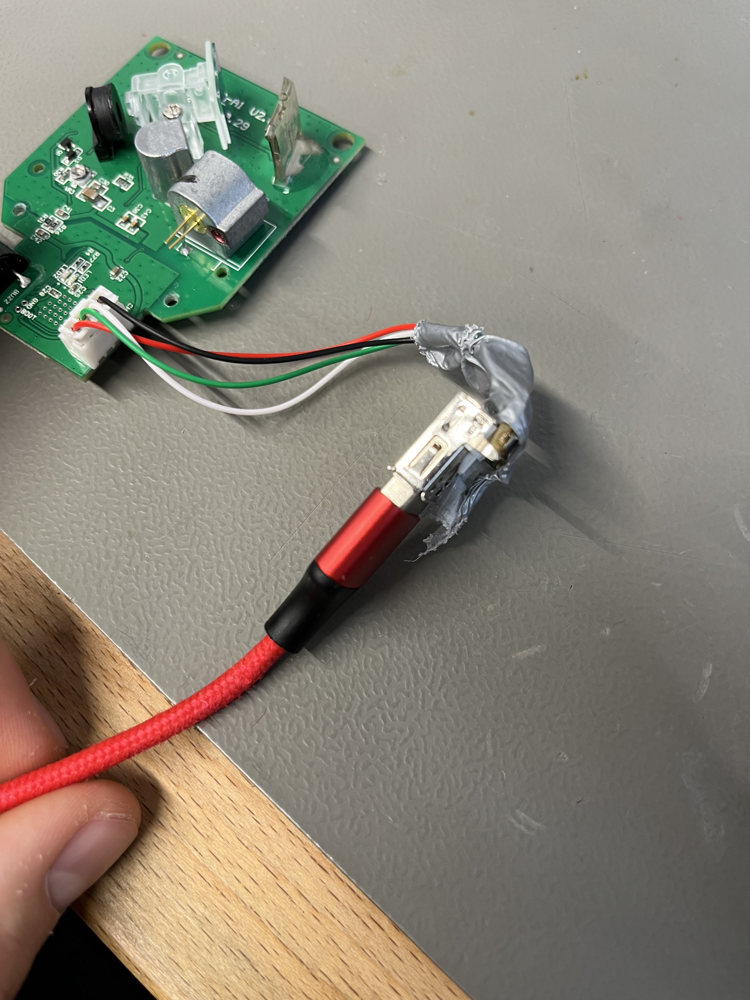
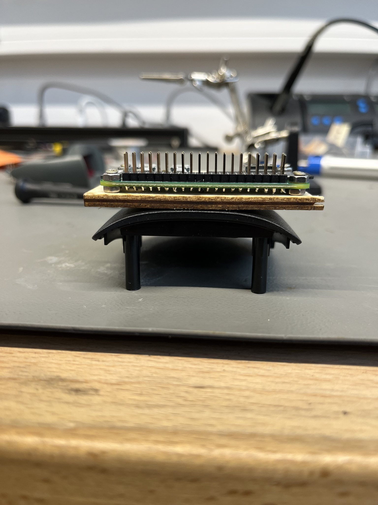
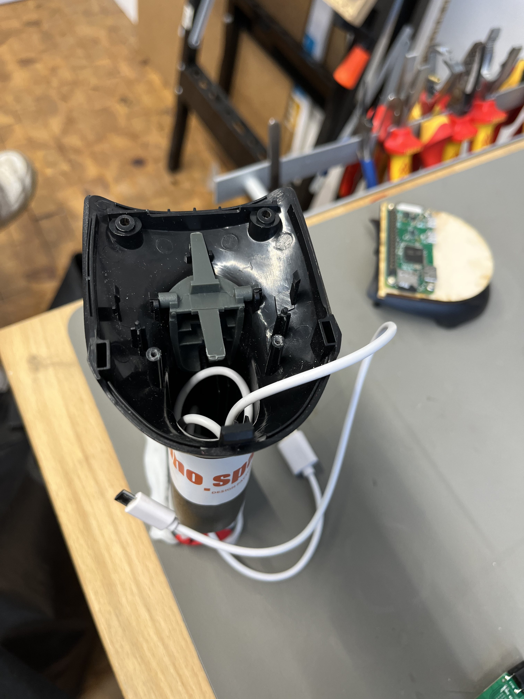
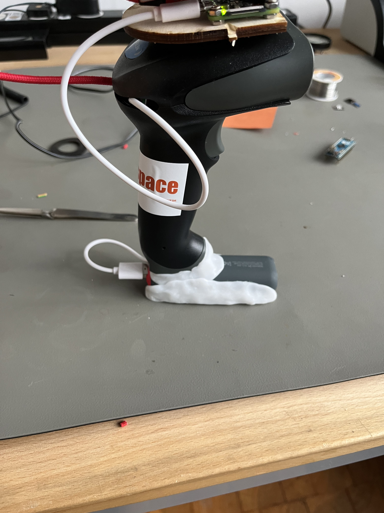

# Ragn4røk - Unser Projekt: EcoSc4n

In dem Projekt wurde sich die Frage gestellt, wie man Menschen dazu
motivieren kann oder darüber informieren kann, wie man Energie spart.

Um dieses Problem zu lösen, haben wir einen Scanner entwickelt, der die
Informationen über die Nachhaltigkeit des Produkts mithilfe des so
genannten
[Ecoscores](https://world.openfoodfacts.org/eco-score-the-environmental-impact-of-food-products)
zusammenfasst, und alternative Produkte vorschlägt, die besser für die
Umwelt sind.

Für dieses Projekt wird ein Raspberry Pi Zero W in Kombination mit einem
Display und einem Scanner verwendet, um die gewünschten Informationen
darzustellen. Eine Anleitung dafür ist im Folgenden zu finden.

# Material

- Raspberry Pi Zero W
- Raspberry Pi Zero W Bildschirm (https://learn.watterott.com/hats/rpi-display/)
- SD-Karte
- Scanner Handelsüblich
- Power Bank
- Modelliermasse
- Holz
- Schrauben
- 2x Micro-Usb-Kabel
- Klebeband
- Lötzinn
- Stiftleiste (2x20)
- Kabel Schnittstellen
- USB-Adapter
- Platinenbrett
- Optional: WEB-Server für farbige Anzeige

# Werkzeuge

- Lötkolben
- Schraubenzieher
- Wasserbad in Mikrowelle ← um Formbares Plastik zu erhitzen
- Lasercutter
- Laptop oder Desktop Rechner
- Pyton IDE

# Empfohlene Vorkenntnisse

- Umgang mit Microcontroller ( Raspberry Pi)
- Python / Flask / JSON Dateien und Online Datenbanken aufrufe
- WEB-Server
- Lasercutter und InkspaInkscapece (Skizze)
- Verkabelung elektronik
- Löten

# Bauanleitung

### Scanner auseinanderbauen

Wir haben einen handelsüblichen Scanner gekauft und zerlegt. Wir haben
uns dabei für ein [preiswertes
Modell](https://www.netum.net/de/collections/barcode-scanner/products/netum-nt-2012-wired-1d-laser-barcode-scanner-black)
entschieden, das nicht zu komplex strukturiert ist. In dem Scanner
befindet sich ein weiterer Microcontroller mit einem integrierten
Scan-Modul, der eigene Einstellungen, wie Soundoptionen, hat.

In einer mitgelieferten Bedienungsanleitung befinden sich Barcodes,
über die der Scanner durch Abscannen dieser Codes konfiguriert werden
kann.

Um den Scanner auseinanderzubauen, müssen die Schrauben gelöst werden,
die an der Unterseite des Scanners unter dem Sticker verschraubt sind:



Nach dem Lösen der Schrauben kann der Scanner einfach
auseinandergenommen werden, da die anderen Teile nur zusammengesteckt
sind.

Das Scan-Modul hat einen USB-A-Male Output. Das USB-Kabel haben wir
aufgetrennt, gekürzt und an einen Micro-USB-Anschluss gelötet. Das
Micro-USB-Kabel kann man jetzt an den Scanner anschließen und den
Scanner wieder zusammenbauen. Es sei darauf hingewiesen, dass die
Datenkabel eventuell nicht den Farben entsprechen.



### Raspberry Pi und Scanner-Microcontroller verbinden

Mit dem Micro-USB Anschluss kann der Scanner-Microcontroller mit dem
Raspberry Pi verbunden werden.

Um zu Testen, ob die Verbindung funktioniert, kann wie im Abschnitt
[Debugging](#debugging) beschrieben vorgegangen werden.


### Display und Pi verbinden

Der Bildschirm vom Raspberry Pi Zero ist speziell für die Ports vom
Zero gemacht, sodass er einfach an die Stiftleiste des Pi's gesteckt
werden kann.

Wir haben uns explizit gegen Verkabelung entschieden, da dadurch bei
ersten Versuchen Wackelkontakte entstanden sind.

Die Stiftleiste wird an den Raspberry Pi Zero gelötet und der Monitor
wird mit seinen Pins auf die Leiste gesteckt.
{width="3.5292136920384953in"
height="3.0086811023622047in"}



### Stromversorgung und Booten

Der Scanner bootet automatisch, sobald eine Stromversorgung
angeschlossen ist. Es muss lediglich eine 5V-Stromversorgung
sichergestellt werden.

Dies kann durch jeden USB-Anschluss oder eine Powerbank erreicht werden.

Beim Booten des Displays müssen ein paar Einstellungen bearbeitet
werden, damit der Pi schnell und korrekt ins Display bootet.

Wie genau das funktioniert, muss für die jeweilige Version des Pis
nachgeschlagen werden. Wichtig ist darauf zu achten, dass beim Start
der Pi die Display-Umgebung öffnet. Das geht durch Hinzufügen eines
Cronjobs mit "@reboot startx".
Danach muss der Scanner direkt in das richtige Programm (Script oder
Browser) starten. Das geht beispielsweise durch Bearbeiten des
Services in /etc/xdg/lxsession/LXDE-pi/autostart. Dieser sieht bei uns
für den Start in den Browser wie folgt aus:
```
@pcmanfm --desktop --profile LXDE-pi
#@lxterminal -e python /home/pi/Desktop/scanner.py
@xscreensaver -no-splash
@xset s off
@xset -dpms
@xset s noblank
@chromium-browser --kiosk https://scanner.pfennig.tech
@unclutter -idle 0.1 -root
```

Für den Start in das Script muss der Kommentar in Zeile zwei entfernt
und dafür der Chromium-Browser einkommentiert werden. Die anderen
Optionen sind für einen schnelleren, einfacheren Start, sowie
Einschränkung der Touchpad-Funktionen.



Der Raspberry Pi Zero W hängt über Micro-USB Kabel mit einer unten
verbauten Power Bank zusammen.

Mit Modelliermasse kann eine Art Sockel als Halterung für die
Powerbank modelliert werden.

Dadurch ist es möglich, durch Ziehen des USB-Kabels an der Power-Bank
die Stromversorgung zu unterbrechen.



### Datenverarbeitung / Raspberry

Der letzte Schritt ist jetzt noch die Daten, die der Scanner liefert,
auszuwerten.
Dabei ist es wichtig zu wissen, dass der Scanner wie eine Tastatur
funktioniert. Demnach wird der Wert des Barcodes gesendet (bspw.
4569023490435) und im Anschluss die "Enter-Taste" betätigt. Das kann
man sich bei der Auswertung zunutze machen.

Dafür gibt es zwei Ansätze; lokal über ein Python-Skript oder extern
über einen Webserver. Die jeweiligen Einstellungen dafür sind bei den
Beschreibungen des Boot-Vorgangs zu finden.

**Lokal:**

Wir haben ein Python-Script entwickelt, das über das Terminal die
Informationen über ein Produkt aufruft. Dieses ist im Github des
Projekts zu finden. Auch dieses greift über WLAN auf die Datenbank von
OpenFoodFacts zu.
Nachteil ist, dass es deutlich schwieriger ist, Produkte zu
vergleichen, sowie farbig darzustellen, weswegen wir dieses Feature
weggelassen haben.

Dafür läuft es autark ohne externe Abhängigkeiten.

**Online:**

Alternativ kann man den Pi so umkonfigurieren, dass er in einen
Headless Browser startet und dort eine URL aufruft, auf der ein
Webserver gehostet ist.

Wir haben dafür eine Anwendung in Flask geschrieben, die ebenfalls im
Github gefunden werden kann. Diese kann einfach in einem
Docker-Container gestartet werden. Das entsprechende Dockerfile liegt
dabei.

Das sieht besser aus, benötigt aber diesen externen Webserver.

## Debugging

Beim Entwicklungsprozess kann es an unterschiedlichen Stellen zu
Problemen kommen, bei denen Debugging vonnöten sein kann.

- Nachdem die USB-Kabel gelötet sind, kann der Scanner an einen

  Computer angeschlossen werden, um zu schauen, ob der Input korrekt
  funktioniert.
- Der Pi startet neu, wenn ein USB-Kabel angeschlossen wird. Das kann

  zeitaufwendig sein. Alternativ kann ein OTG-Adapter verwendet
  werden.
- Eine permanente, portable Stromquelle ist hilfreich, damit der Pi

  nicht beim Ortswechsel neu starten muss.
- Ein Multimeter hilft, Ungenauigkeiten beim Lötstellen zu finden.

# Ausblick

Um den Scanner weiterzuentwickeln, haben wir verschiedene Ansätze
entwickelt, die den Scanner zusätzlich verbessern.

## Supermarktwähler

Eine bessere Verwendung für den Supermarkt durch Kooperation mit diesen,
sodass das Gerät nicht so exotisch wirkt.

## Andere Sounds

Bei dem Scannen "guter" Produkte soll eine andere Melodie erklingen, als
bei dem Scannen schlechter Produkte. So soll die audiovisuelle
Rückmeldung gestärkt werden.

Dabei muss auf den in das Scan-Modul eingebauten Mikrocontroller
zugegriffen werden.

## Andere Designs

Neben der aktuell vorhandenen Version des Scanners sind mittels 3D-Druck
unterschiedliche optische Varianten des Scanners denkbar: ein Blaster,
wie in Star Wars oder eine Uzi, wie in GTA. Für Menschen, die besonders
intensiv einkaufen ist auch ein Aufbau, wie bei einem
Scharfschützengewehr denkbar,

## Verbindung zu Nutriscore o.Ä

Durch den analogen Aufbau des Ecoscore ist eine Verbindung zum
Nutriscore möglich, sodass der Nutzer direkt beide Optionen zum
Vergleich hat. Damit lassen sich zusätzlich die Verwirrungen auflösen,
die die Systeme aufwerfen.
